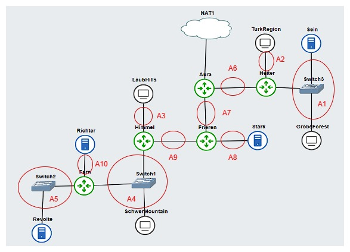

# Jarkom-Modul-5-E06-2023
Berikut adalah repository dari kelompok E06 untuk pengerjaan Praktikum Modul 5 Jaringan Komputer. 

# Anggota Kelompok
| Nama | NRP | 
| --- | --- |
| Muhammad Hafidh Rosyadi | 5025211013 |
| Kartika Diva Asmara Gita | 5025211039 |

# Dokumentasi Pengerjaan 
## Subnetting VLSM
Menentukan jumlah subnet pada topologi.


Menentukan jumlah alamat IP yang dibutuhkan oleh tiap subnet.
| Subnet | Jumlah IP | Netmask | 
| --- | --- | --- |
| A1 | 514 | /22 |
| A2 | 1023 | /21 | 
| A3 | 256 | /23 |
| A4 | 66 | /25 |
| A5 | 2 | /30 |
| A6 | 2 | /30 |
| A7 | 2 | /30 |
| A8 | 2 | /30 |
| A9 | 2 | /30 |
| A10 | 2 | /30 |
| Total | 1871 | /21 |

Berdasarkan total IP dan netmask yang dibutuhkan, Subnet besar yang dibentuk memiliki NID `192.209.0.0` dengan Netmask `/20`.

## Tree VLSM
Menghitung pembagian IP berdasarkan NID dan Netmask yang didapatkan.


Dari Tree di atas akan mendapat pembagian IP sebagai berikut.


## Configuration
Mengatur Network Configuration masing-masing interface pada setiap node.

### Router
- Aura
```
auto eth0
iface eth0 inet dhcp

#A6 Aura-Heiter
auto eth1
iface eth1 inet static
	address 192.209.1.109
	netmask 255.255.255.252

#A7 Aura-Frieren
auto eth2
iface eth2 inet static
	address 192.209.1.113
	netmask 255.255.255.252
```
- Heiter
```
#A6 Aura-Heiter
auto eth0
iface eth0 inet static
	address 192.209.1.110
	netmask 255.255.255.252
	gateway 192.209.1.109

#A2 Heiter-TurkRegion
auto eth1
iface eth1 inet static
	address 192.209.8.1
	netmask 255.255.248.0

#A1 Heiter-Switch3
# Sein, GrobeForest
auto eth2
iface eth2 inet static
	address 192.209.4.1
	netmask 255.255.252.0
```
- Frieren
```
#A7 Aura-Frieren
auto eth0
iface eth0 inet static
	address 192.209.1.114
	netmask 255.255.255.252
	gateway 192.209.1.113

#A8 Frieren-Stark
auto eth1
iface eth1 inet static
	address 192.209.1.117
	netmask 255.255.255.252

#A9 Frieren-Himmel
auto eth2
iface eth2 inet static
	address 192.209.1.121
	netmask 255.255.255.252
```
- Himmel
```
#A9 Frieren-Himmel
auto eth0
iface eth0 inet static
	address 192.209.1.122
	netmask 255.255.255.252
	gateway 192.209.1.121

#A3 Himmel-LaubHills
auto eth1
iface eth1 inet static
	address 192.209.2.1
	netmask 255.255.254.0

#A4 Himmel-Switch1
#Schwer Mountain, Fern
auto eth2
iface eth2 inet static
	address 192.209.1.129
	netmask 255.255.255.128
```
- Fern
```
#A4 Himmel-Fern
auto eth0
iface eth0 inet static
	address 192.209.1.131
	netmask 255.255.255.128
	gateway 192.209.1.129

#A10 Fern-Ritcher
auto eth1
iface eth1 inet static
	address 192.209.1.125
	netmask 255.255.255.252

#A5 Fern-Revolte
#Schwer Mountain, Fern
auto eth2
iface eth2 inet static
	address 192.209.1.105
	netmask 255.255.255.252
```
### Client
- Turk Region
```
#A6 Aura-Heiter
auto eth0
iface eth0 inet dhcp
	gateway 192.209.8.1
```
- Grobe Forest
```
#A6 Aura-Heiter
auto eth0
iface eth0 inet dhcp
	gateway 192.209.4.1
```
- Laub Hills
```
#A3 Himmel-LaubHills
auto eth0
iface eth0 inet dhcp
	gateway 192.209.2.1
```
- Schwer Mountain
```
#A4 Himmel-LaubHills
auto eth0
iface eth0 inet dhcp
	gateway 192.209.1.129
```
### Server
- Sein
```
#A6 Aura-Heiter
auto eth0
iface eth0 inet static
	address 192.209.4.2
	netmask 255.255.252.0
	gateway 192.209.4.1
```
- Stark
```
#A8 Frieren-Stark
auto eth0
iface eth0 inet static
	address 192.209.1.118
	netmask 255.255.255.252
	gateway 192.209.1.117
```
- Ritcher
```
#A10 Fern-Ritcher
auto eth0
iface eth0 inet static
	address 192.209.1.126
	netmask 255.255.255.252
	gateway 192.209.1.125
```
- Revolte
```
#A5 Fern-Revolte
auto eth0
iface eth0 inet static
	address 192.209.1.106
	netmask 255.255.255.252
	gateway 192.209.1.105
```

## Route Configuration
Berikut adalah konfigurasi routing.
- Heiter
```
route add -net 0.0.0.0 netmask 0.0.0.0 gw 192.209.1.109	#default A6,A2,A1
```
- Fern
```
route add -net 0.0.0.0 netmask 0.0.0.0 gw 192.209.1.129	#default A5,A10
```
- Himmel
```
route add -net 0.0.0.0 netmask 0.0.0.0 gw 192.209.1.121	#default A3,A4,A9
route add -net 192.209.1.124 netmask 255.255.255.252 gw 192.209.1.131	#A10
route add -net 192.209.1.104 netmask 255.255.255.252 gw 192.209.1.131	#A5
```
- Frieren
```
route add -net 0.0.0.0 netmask 0.0.0.0 gw 192.209.1.113	#default A7,A8,A9
route add -net 192.209.1.104 netmask 255.255.255.252 gw 192.209.1.122	#A5
route add -net 192.209.1.124 netmask 255.255.255.252 gw 192.209.1.122	#A10
route add -net 192.209.1.128 netmask 255.255.255.128 gw 192.209.1.122	#A4
route add -net 192.209.2.0 netmask 255.255.254.0 gw 192.209.1.122	#A3
```
- Aura
```
#eth1
route add -net 192.209.8.0 netmask 255.255.248.0 gw 192.209.1.110	#A2
route add -net 192.209.4.0 netmask 255.255.252.0 gw 192.209.1.110	#A1
#eth2
route add -net 192.209.1.116 netmask 255.255.255.252 gw 192.209.1.114	#A8
route add -net 192.209.1.120 netmask 255.255.255.252 gw 192.209.1.114	#A9
route add -net 192.209.2.0 netmask 255.255.254.0 gw 192.209.1.114	#A3
route add -net 192.209.1.128 netmask 255.255.255.128 gw 192.209.1.114	#A4
route add -net 192.209.1.124 netmask 255.255.255.252 gw 192.209.1.114	#A10
route add -net 192.209.1.104 netmask 255.255.255.252 gw 192.209.1.114	#A5
```
