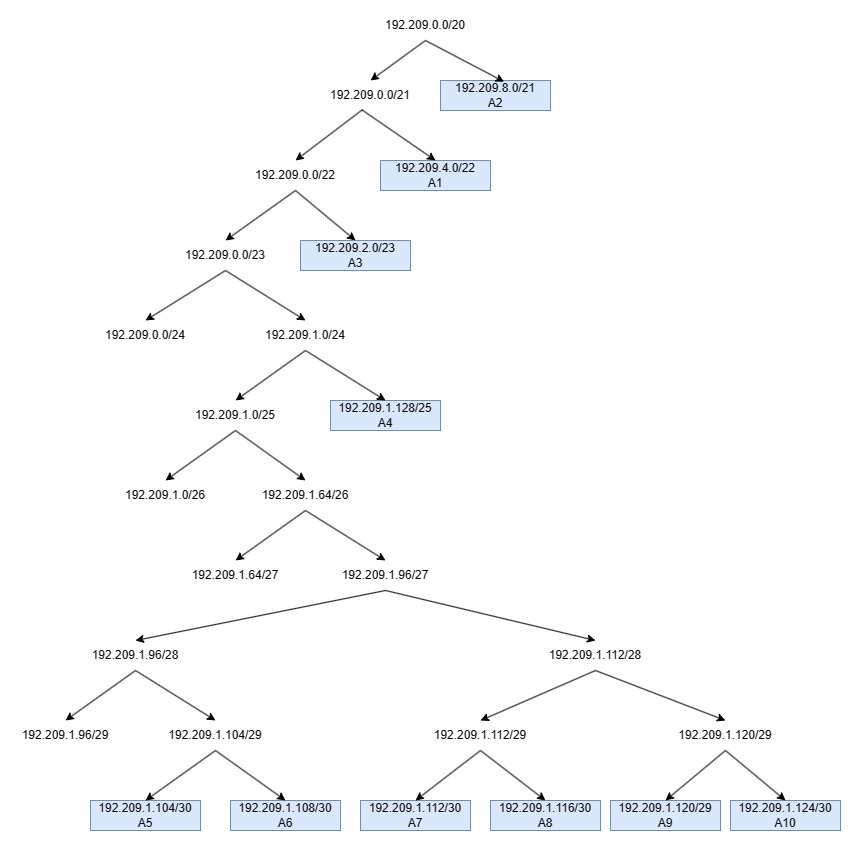

# Jarkom-Modul-5-E06-2023
Berikut adalah repository dari kelompok E06 untuk pengerjaan Praktikum Modul 5 Jaringan Komputer. 

# Anggota Kelompok
| Nama | NRP | 
| --- | --- |
| Muhammad Hafidh Rosyadi | 5025211013 |
| Kartika Diva Asmara Gita | 5025211039 |

# Dokumentasi Pengerjaan 
## Subnetting VLSM
Menentukan jumlah subnet pada topologi.


Menentukan jumlah alamat IP yang dibutuhkan oleh tiap subnet.
| Subnet | Jumlah IP | Netmask | 
| --- | --- | --- |
| A1 | 514 | /22 |
| A2 | 1023 | /21 | 
| A3 | 256 | /23 |
| A4 | 66 | /25 |
| A5 | 2 | /30 |
| A6 | 2 | /30 |
| A7 | 2 | /30 |
| A8 | 2 | /30 |
| A9 | 2 | /30 |
| A10 | 2 | /30 |
| Total | 1871 | /21 |

Berdasarkan total IP dan netmask yang dibutuhkan, Subnet besar yang dibentuk memiliki NID `192.209.0.0` dengan Netmask `/20`.

## Tree VLSM
Menghitung pembagian IP berdasarkan NID dan Netmask yang didapatkan.


Dari Tree di atas akan mendapat pembagian IP sebagai berikut.


## Configuration
Mengatur Network Configuration masing-masing interface pada setiap node.

### Router
- Aura
```
auto eth0
iface eth0 inet dhcp

#A6 Aura-Heiter
auto eth1
iface eth1 inet static
	address 192.209.1.109
	netmask 255.255.255.252

#A7 Aura-Frieren
auto eth2
iface eth2 inet static
	address 192.209.1.113
	netmask 255.255.255.252
```
- Heiter
```
#A6 Aura-Heiter
auto eth0
iface eth0 inet static
	address 192.209.1.110
	netmask 255.255.255.252
	gateway 192.209.1.109

#A2 Heiter-TurkRegion
auto eth1
iface eth1 inet static
	address 192.209.8.1
	netmask 255.255.248.0

#A1 Heiter-Switch3
# Sein, GrobeForest
auto eth2
iface eth2 inet static
	address 192.209.4.1
	netmask 255.255.252.0
```
- Frieren
```
#A7 Aura-Frieren
auto eth0
iface eth0 inet static
	address 192.209.1.114
	netmask 255.255.255.252
	gateway 192.209.1.113

#A8 Frieren-Stark
auto eth1
iface eth1 inet static
	address 192.209.1.117
	netmask 255.255.255.252

#A9 Frieren-Himmel
auto eth2
iface eth2 inet static
	address 192.209.1.121
	netmask 255.255.255.252
```
- Himmel
```
#A9 Frieren-Himmel
auto eth0
iface eth0 inet static
	address 192.209.1.122
	netmask 255.255.255.252
	gateway 192.209.1.121

#A3 Himmel-LaubHills
auto eth1
iface eth1 inet static
	address 192.209.2.1
	netmask 255.255.254.0

#A4 Himmel-Switch1
#Schwer Mountain, Fern
auto eth2
iface eth2 inet static
	address 192.209.1.129
	netmask 255.255.255.128
```
- Fern
```
#A4 Himmel-Fern
auto eth0
iface eth0 inet static
	address 192.209.1.131
	netmask 255.255.255.128
	gateway 192.209.1.129

#A10 Fern-Ritcher
auto eth1
iface eth1 inet static
	address 192.209.1.125
	netmask 255.255.255.252

#A5 Fern-Revolte
#Schwer Mountain, Fern
auto eth2
iface eth2 inet static
	address 192.209.1.105
	netmask 255.255.255.252
```
### Client
- Turk Region
```
#A6 Aura-Heiter
auto eth0
iface eth0 inet dhcp
	gateway 192.209.8.1
```
- Grobe Forest
```
#A6 Aura-Heiter
auto eth0
iface eth0 inet dhcp
	gateway 192.209.4.1
```
- Laub Hills
```
#A3 Himmel-LaubHills
auto eth0
iface eth0 inet dhcp
	gateway 192.209.2.1
```
- Schwer Mountain
```
#A4 Himmel-LaubHills
auto eth0
iface eth0 inet dhcp
	gateway 192.209.1.129
```
### Server
- Sein
```
#A6 Aura-Heiter
auto eth0
iface eth0 inet static
	address 192.209.4.2
	netmask 255.255.252.0
	gateway 192.209.4.1
```
- Stark
```
#A8 Frieren-Stark
auto eth0
iface eth0 inet static
	address 192.209.1.118
	netmask 255.255.255.252
	gateway 192.209.1.117
```
- Ritcher
```
#A10 Fern-Ritcher
auto eth0
iface eth0 inet static
	address 192.209.1.126
	netmask 255.255.255.252
	gateway 192.209.1.125
```
- Revolte
```
#A5 Fern-Revolte
auto eth0
iface eth0 inet static
	address 192.209.1.106
	netmask 255.255.255.252
	gateway 192.209.1.105
```

## Route Configuration
Berikut adalah konfigurasi routing.
- Heiter
```
route add -net 0.0.0.0 netmask 0.0.0.0 gw 192.209.1.109	#default A6,A2,A1
```
- Fern
```
route add -net 0.0.0.0 netmask 0.0.0.0 gw 192.209.1.129	#default A5,A10
```
- Himmel
```
route add -net 0.0.0.0 netmask 0.0.0.0 gw 192.209.1.121	#default A3,A4,A9
route add -net 192.209.1.124 netmask 255.255.255.252 gw 192.209.1.131	#A10
route add -net 192.209.1.104 netmask 255.255.255.252 gw 192.209.1.131	#A5
```
- Frieren
```
route add -net 0.0.0.0 netmask 0.0.0.0 gw 192.209.1.113	#default A7,A8,A9
route add -net 192.209.1.104 netmask 255.255.255.252 gw 192.209.1.122	#A5
route add -net 192.209.1.124 netmask 255.255.255.252 gw 192.209.1.122	#A10
route add -net 192.209.1.128 netmask 255.255.255.128 gw 192.209.1.122	#A4
route add -net 192.209.2.0 netmask 255.255.254.0 gw 192.209.1.122	#A3
```
- Aura
```
#eth1
route add -net 192.209.8.0 netmask 255.255.248.0 gw 192.209.1.110	#A2
route add -net 192.209.4.0 netmask 255.255.252.0 gw 192.209.1.110	#A1
#eth2
route add -net 192.209.1.116 netmask 255.255.255.252 gw 192.209.1.114	#A8
route add -net 192.209.1.120 netmask 255.255.255.252 gw 192.209.1.114	#A9
route add -net 192.209.2.0 netmask 255.255.254.0 gw 192.209.1.114	#A3
route add -net 192.209.1.128 netmask 255.255.255.128 gw 192.209.1.114	#A4
route add -net 192.209.1.124 netmask 255.255.255.252 gw 192.209.1.114	#A10
route add -net 192.209.1.104 netmask 255.255.255.252 gw 192.209.1.114	#A5
```

## DHCP
### Revolte (DHCP Server)

```
apt-get update -y
apt-get install isc-dhcp-server -y
apt-get install netcat -y

echo '
INTERFACESv4="eth0"
INTERFACESv6=' > /etc/default/isc-dhcp-server

echo '
# A1
subnet 192.209.4.0 netmask 255.255.252.0 {
    range 192.209.4.3 192.209.7.254;
    option routers 192.209.4.1;
    option broadcast-address 192.209.7.255;
    option domain-name-servers 192.209.1.126;
}

# A2
subnet 192.209.8.0 netmask 255.255.248.0 {
    range 192.209.8.2 192.209.15.254;
    option routers 192.209.8.1;
    option broadcast-address 192.209.15.255;
    option domain-name-servers 192.209.1.126;
}

# A3
subnet 192.209.2.0 netmask 255.255.254.0 {
    range 192.209.2.2 192.209.3.254;
    option routers 192.209.2.1;
    option broadcast-address 192.209.3.255;
    option domain-name-servers 192.209.1.126;
}

# A4
subnet 192.209.1.128 netmask 255.255.255.128 {
    range 192.209.1.131 192.209.1.254;
    option routers 192.209.1.129;
    option broadcast-address 192.209.1.255;
    option domain-name-servers 192.209.1.126;
}

# A5
subnet 192.209.1.104 netmask 255.255.255.252 {
}

# A6
subnet 192.209.1.108 netmask 255.255.255.252 {
}

# A7
subnet 192.209.1.112 netmask 255.255.255.252 {
}

# A8
subnet 192.209.1.116 netmask 255.255.255.252 {
}

# A9
subnet 192.209.1.120 netmask 255.255.255.252 {
}

# A10
subnet 192.209.1.124 netmask 255.255.255.252 {
}

' > /etc/dhcp/dhcpd.conf

service isc-dhcp-server restart
```

### Heiter dan Himmel (DHCP Relay)

```
apt-get update -y
apt-get install isc-dhcp-relay -y

echo '
SERVERS="192.209.1.106"
INTERFACES="eth0 eth1 eth2"
OPTIONS=' > /etc/default/isc-dhcp-relay

echo 'net.ipv4.ip_forward=1' > /etc/sysctl.conf

service isc-dhcp-relay start
```

## Nomor 1
Agar topologi yang kalian buat dapat mengakses keluar, kalian diminta untuk mengkonfigurasi Aura menggunakan iptables, tetapi tidak ingin menggunakan MASQUERADE.

command berikut dimasukkan kedalam node `aura`
```
iptables -t nat -A POSTROUTING -s 192.209.0.0/20 -o eth0 -j SNAT --to-source $(hostname -I | awk '{print $1}')
```
- `-t nat`: Option -t digunakan untuk menentukan tabel mana yang akan diatur aturannya. Pada kasus ini, kita mengatur tabel nat yang berfungsi untuk mengatur aturan NAT.

- `-A POSTROUTING`: Option -A berarti menambahkan aturan baru ke chain (rantai) yang ditentukan. POSTROUTING adalah salah satu chain di dalam tabel nat yang memungkinkan manipulasi terhadap paket sebelum keluar dari sistem.

- `-s 192.209.0.0/20`: Menentukan sumber dari paket yang akan diproses oleh aturan ini. Di sini, hanya paket dengan sumber IP dalam rentang 192.209.0.0/20 yang akan dipengaruhi oleh aturan ini.

- `-o eth0`: Option -o digunakan untuk menyatakan interface keluar di mana paket-paket tersebut akan dikirim. Dalam hal ini, paket akan dikirim melalui interface eth0.

- `-j SNAT`: Option -j digunakan untuk menentukan apa yang harus dilakukan dengan paket yang cocok dengan aturan ini. SNAT adalah target yang digunakan untuk melakukan Source NAT (Network Address Translation), yang mengubah alamat sumber dari paket-paket tersebut.

- `--to-source $(hostname -I | awk '{print $1}')`: Bagian ini adalah argumen dari target SNAT. Ini digunakan untuk menentukan alamat IP yang akan digunakan sebagai sumber setelah proses SNAT. Pada perintah ini, $(hostname -I | awk '{print $1}') digunakan untuk mendapatkan alamat IP dari host saat ini dengan bantuan perintah hostname dan awk. Perintah hostname -I mengambil semua alamat IP yang terkait dengan hostname, dan awk '{print $1}' digunakan untuk mengambil alamat IP pertama dari daftar tersebut.


## Nomor 2
Kalian diminta untuk melakukan drop semua TCP dan UDP kecuali port 8080 pada TCP.
Pada client(dalam kasus kami adalah turkregion)
```
iptables -A INPUT -p tcp --dport 8080 -j ACCEPT
iptables -A INPUT -p tcp -j DROP
iptables -A INPUT -p udp -j DROP
```
Perintah 1:
```
iptables -A INPUT -p tcp --dport 8080 -j ACCEPT
```
- `-A INPUT`: Menambahkan aturan ke chain (rantai) INPUT, yang memproses paket-paket masuk.
- `-p tcp`: Menentukan protokol yang diizinkan, dalam hal ini adalah TCP.
- `--dport 8080`: Mengatur aturan agar hanya paket dengan port tujuan 8080 yang diizinkan.
- `-j ACCEPT`: Mengizinkan paket yang memenuhi kriteria di atas untuk masuk ke sistem.

Perintah 2:
```
iptables -A INPUT -p tcp -j DROP
```
- `-A INPUT`: Menambahkan aturan ke chain INPUT.
- `-p tcp`: Menentukan protokol yang diizinkan, dalam hal ini adalah TCP.
- `-j DROP`: Perintah untuk menjatuhkan (drop) semua paket TCP yang mencapai aturan ini. Ini berarti semua paket TCP akan ditolak atau dibuang oleh firewall(kecuali pada port yang telah diset pada perintah pertama.).

Perintah 3:
```
iptables -A INPUT -p udp -j DROP
```
- `-A INPUT`: Menambahkan aturan ke chain INPUT.
- `-p udp`: Menentukan protokol yang diizinkan, dalam hal ini adalah UDP.
- `-j DROP`: Mengarahkan firewall untuk menjatuhkan (drop) semua paket UDP yang mencapai aturan ini. Ini akan menyebabkan firewall menolak atau membuang semua paket yang menggunakan protokol UDP.


## Nomor 3
Kepala Suku North Area meminta kalian untuk membatasi DHCP dan DNS Server hanya dapat dilakukan ping oleh maksimal 3 device secara bersamaan, selebihnya akan di drop.

aturan yang harus dimasukkan pada Revolte (DHCP Server) dan Richter (DNS Server):
```
iptables -A INPUT -p icmp -m connlimit --connlimit-above 3 --connlimit-mask 0 -j DROP
```
Aturan ini menggunakan modul connlimit untuk membatasi jumlah koneksi ICMP yang diizinkan hanya 3 per IP.
Jika jumlah koneksi ICMP melebihi batas yang ditentukan (3 koneksi per IP), aturan ini akan menjatuhkan atau membuang paket ICMP tersebut.


## Nomor 4 
Lakukan pembatasan sehingga koneksi SSH pada Web Server hanya dapat dilakukan oleh masyarakat yang berada pada GrobeForest.

aturan yang harus dimasukkan kedalam webserver (sein dan stark)
```
iptables -A INPUT -p tcp --dport 22 -s 192.209.4.0/22 -j ACCEPT
iptables -A INPUT -p tcp --dport 22 -j DROP
```

- `-A INPUT`: Menambahkan aturan ke chain (rantai) INPUT, yang memproses paket-paket masuk.
- `-p tcp`: Menentukan protokol yang diizinkan, dalam hal ini adalah TCP.
- `--dport 22`: Mengatur aturan agar hanya paket dengan port tujuan 22 (biasanya untuk layanan SSH) yang diizinkan.
- `-s 192.209.4.0/22`: Menetapkan alamat sumber yang diizinkan, dalam hal ini hanya paket-paket yang berasal dari jaringan dengan rentang IP 192.209.4.0 hingga 192.209.7.255 yang diizinkan (subnet dengan CIDR /22).
- `-j ACCEPT`: Mengizinkan paket yang memenuhi kriteria di atas untuk masuk ke sistem.

Aturan kedua menolak semua paket TCP dengan port tujuan 22 yang tidak sesuai dengan aturan pertama, sehingga memblokir akses SSH dari sumber yang bukan dari rentang IP yang diizinkan pada aturan pertama.


## Nomor 5
Selain itu, akses menuju WebServer hanya diperbolehkan saat jam kerja yaitu Senin-Jumat pada pukul 08.00-16.00.

aturan untuk webserver
```
iptables -A INPUT -p tcp --dport 22 -m time --weekdays Mon,Tue,Wed,Thu,Fri --timestart 08:00 --timestop 16:00 -s 192.209.4.0/22 -j ACCEPT
```
- `-A INPUT`: Menambahkan aturan ke chain (rantai) INPUT, yang memproses paket-paket masuk.
- `-p tcp`: Menentukan protokol yang diizinkan, dalam hal ini adalah TCP.
- `--dport 22`: Mengatur aturan agar hanya paket dengan port tujuan 22 (biasanya untuk layanan SSH) yang terkena aturan ini.
- `-m time`: Menggunakan modul time yang memungkinkan penggunaan pembatasan waktu untuk aturan tertentu.
- `--weekdays Mon,Tue,Wed,Thu,Fri`: Menetapkan hari-hari di mana aturan ini berlaku, yaitu Senin hingga Jumat (hari kerja).
- `--timestart 08:00`: Menentukan waktu mulai aturan, dalam hal ini pukul 08:00 (pagi).
- `--timestop 16:00`: Menentukan waktu berakhirnya aturan, dalam hal ini pukul 16:00 (siang).
- `-s 192.209.4.0/22`: Menetapkan alamat sumber yang diizinkan, dalam hal ini hanya paket-paket yang berasal dari jaringan dengan rentang IP 192.209.4.0 hingga 192.209.7.255 yang diizinkan (subnet dengan CIDR /22).
- `-j ACCEPT`: Mengizinkan paket yang memenuhi kriteria di atas untuk masuk ke sistem.


## Nomor 6
Lalu, karena ternyata terdapat beberapa waktu di mana network administrator dari WebServer tidak bisa stand by, sehingga perlu ditambahkan rule bahwa akses pada hari Senin - Kamis pada jam 12.00 - 13.00 dilarang (istirahat maksi cuy) dan akses di hari Jumat pada jam 11.00 - 13.00 juga dilarang (maklum, Jumatan rek).

```
iptables -A INPUT -p tcp --dport 22 -m time --weekdays Mon,Tue,Wed,Thu --timestart 12:00 --timestop 13:00 -j DROP
iptables -A INPUT -p tcp --dport 22 -m time --weekdays Fri --timestart 11:00 --timestop 13:00 -j DROP
```
aturan pertama:
Pada hari Senin hingga Kamis, aturan ini menolak akses pada port 22 dari pukul 12:00 siang hingga 13:00 siang.
aturan kedua:
Pada hari Jumat, aturan ini menolak akses pada port 22 dari pukul 11:00 pagi hingga 13:00 siang.


## Nomor 7
Karena terdapat 2 WebServer, kalian diminta agar setiap client yang mengakses Sein dengan Port 80 akan didistribusikan secara bergantian pada Sein dan Stark secara berurutan dan request dari client yang mengakses Stark dengan port 443 akan didistribusikan secara bergantian pada Sein dan Stark secara berurutan.

Pada Router Heiter dan Frieren (router webserver)
```
iptables -t nat -F
iptables -A PREROUTING -t nat -p tcp --dport 80 -d 192.209.4.2 -m statistic --mode nth --every 2 --packet 0 -j DNAT --to-destination 192.209.4.2
iptables -A PREROUTING -t nat -p tcp --dport 80 -d 192.209.4.2 -j DNAT --to-destination 192.209.1.118
iptables -A PREROUTING -t nat -p tcp --dport 443 -d 192.209.1.118 -m statistic --mode nth --every 2 --packet 0 -j DNAT --to-destination 192.209.1.118
iptables -A PREROUTING -t nat -p tcp --dport 443 -d 192.209.1.118 -j DNAT --to-destination 192.209.4.2
```
- iptables -t nat -F: Perintah ini membersihkan (flush) semua aturan yang ada di tabel nat pada iptables. Dengan kata lain, ini menghapus semua aturan-aturan yang sebelumnya telah dibuat di tabel NAT.

- iptables -A PREROUTING -t nat -p tcp --dport 80 -d 192.209.4.2 -m statistic --mode nth --every 2 --packet 0 -j DNAT --to-destination 192.209.4.2: Aturan ini mengubah (DNAT) paket-paket yang datang ke port 80 (HTTP) dengan tujuan IP 192.209.4.2. Aturan ini menggunakan modul statistik (statistic) untuk memilih paket-paket tertentu dalam urutan (mode nth) yang ke-2 (--every 2) dari awal (--packet 0) untuk diarahkan ke alamat tujuan 192.209.4.2.

- iptables -A PREROUTING -t nat -p tcp --dport 80 -d 192.209.4.2 -j DNAT --to-destination 192.209.1.118: Ini adalah aturan kedua untuk lalu lintas HTTP (port 80) yang ditujukan ke 192.209.4.2. Jika paket tidak memenuhi kriteria aturan pertama, aturan ini akan memindahkan (DNAT) paket-paket tersebut ke alamat tujuan 192.209.1.118.

- iptables -A PREROUTING -t nat -p tcp --dport 443 -d 192.209.1.118 -m statistic --mode nth --every 2 --packet 0 -j DNAT --to-destination 192.209.1.118: Ini adalah aturan yang mirip dengan aturan pertama, namun untuk lalu lintas HTTPS (port 443). Ini juga menggunakan statistik untuk memilih paket dalam urutan tertentu untuk diarahkan ke alamat tujuan 192.209.1.118.

- iptables -A PREROUTING -t nat -p tcp --dport 443 -d 192.209.1.118 -j DNAT --to-destination 192.209.4.2: Aturan terakhir untuk lalu lintas HTTPS yang ditujukan ke 192.209.1.118. Jika paket tidak memenuhi kriteria aturan sebelumnya, aturan ini akan memindahkan (DNAT) paket-paket tersebut ke alamat tujuan 192.209.4.2.
testing dilakukan dengan 'while true; do nc -l -p 80 -c 'echo "Sein"'; done' pada sein dan `while true; do nc -l -p 80 -c 'echo "Stark"'; done` untuk mentrace aliran paket.


## Nomor 8
Karena berbeda koalisi politik, maka subnet dengan masyarakat yang berada pada Revolte dilarang keras mengakses WebServer hingga masa pencoblosan pemilu kepala suku 2024 berakhir. Masa pemilu (hingga pemungutan dan penghitungan suara selesai) kepala suku bersamaan dengan masa pemilu Presiden dan Wakil Presiden Indonesia 2024.
```
REVOLTE="192.209.1.104/30"
MULAI=$(date -d "2023-02-14T00:00" +"%Y-%m-%dT%H:%M")
SELESAI=$(date -d "2024-06-26T00:00" +"%Y-%m-%dT%H:%M")
iptables -A INPUT -p tcp -s $REVOLTE --dport 80 -m time --datestart "$MULAI" --datestop "$SELESAI" -j DROP
```
diberi aturan agar 14 Februari 2024 pukul 00:00 hingga tanggal 26 Juni 2024 pukul 23:59 subnet tidak bisa mengakses webserver.


## Nomor 9
Sadar akan adanya potensial saling serang antar kubu politik, maka WebServer harus dapat secara otomatis memblokir  alamat IP yang melakukan scanning port dalam jumlah banyak (maksimal 20 scan port) di dalam selang waktu 10 menit. 
```
iptables -N portscan
iptables -A INPUT -m recent --name portscan --update --seconds 600 --hitcount 20 -j DROP
iptables -A FORWARD -m recent --name portscan --update --seconds 600 --hitcount 20 -j DROP
iptables -A INPUT -m recent --name portscan --set -j ACCEPT
iptables -A FORWARD -m recent --name portscan --set -j ACCEPT
```
- `iptables -N portscan`: Membuat sebuah chain baru bernama 'portscan'.
- `iptables -A INPUT -m recent --name portscan --update --seconds 600 --hitcount 20 -j DROP`: Mengatur aturan pada chain INPUT untuk menolak paket-paket yang masuk (INPUT) apabila jumlah koneksi yang terdeteksi dari satu alamat IP melebihi 20 kali dalam waktu 600 detik (10 menit). Jika terjadi pelanggaran aturan ini, paket-paket tersebut akan ditolak (DROP).
- `iptables -A FORWARD -m recent --name portscan --update --seconds 600 --hitcount 20 -j DROP`: Sama seperti aturan sebelumnya, namun aturan ini diterapkan pada chain FORWARD, yang berlaku untuk paket yang diteruskan melalui sistem (misalnya, sebagai router). Ini juga akan menolak paket yang memenuhi kriteria yang sama.
- `iptables -A INPUT -m recent --name portscan --set -j ACCEPT`: Mengatur aturan pada chain INPUT untuk memperbarui 'recent list' (daftar yang menyimpan informasi tentang koneksi terbaru) dengan alamat IP dari paket yang masuk. Ini digunakan untuk menandai alamat IP tersebut sebagai 'aman' (ACCEPT).
- `iptables -A FORWARD -m recent --name portscan --set -j ACCEPT`: Sama seperti aturan sebelumnya, tetapi diterapkan pada chain FORWARD, menandai alamat IP dari paket yang diteruskan sebagai 'aman' (ACCEPT).


## Nomor 10
Karena kepala suku ingin tau paket apa saja yang di-drop, maka di setiap node server dan router ditambahkan logging paket yang di-drop dengan standard syslog level. 
```
iptables -A INPUT -j LOG --log-level debug --log-prefix 'Packet Drop' -m limit --limit 1/second --limit-burst 10
```
Mengarahkan semua paket yang tiba di chain INPUT untuk dicatat dalam log sistem dengan pesan 'Packet Drop' sebagai prefix.
Mengatur tingkat detail log menjadi 'debug' untuk informasi yang lebih rinci.
Menerapkan pembatasan pada frekuensi pencatatan log, hanya mencatat satu pesan per detik dengan batas maksimum 10 pesan dalam satu burst.
